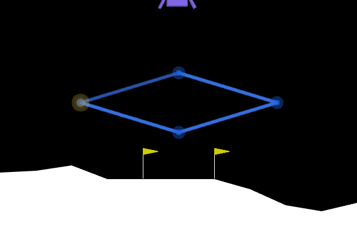
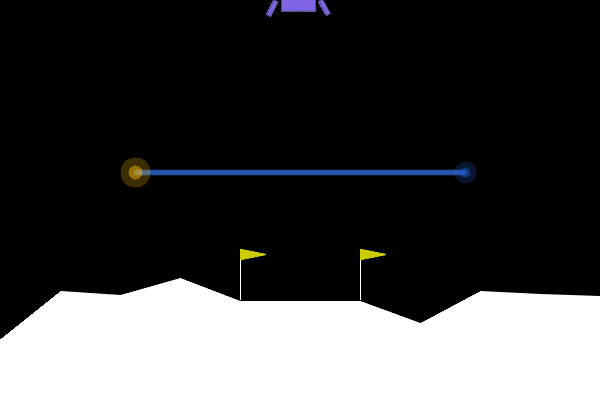

# LunarLander 拓展任务整理

本文档整理仓库中拓展任务的任务定义、环境包装、输入输出、强化学习算法结果，以及规则专家系统的设计迭代和可视化结果。当前真正落地的拓展方向是“按指定航点路线飞行后再降落”，代码主要位于 `lunar_lander_rl/trajectory_env.py`、`lunar_lander_rl/run_trajectory_suite.py`、`lunar_lander_rl/expert_policy.py` 和 `lunar_lander_rl/run_expert_suite.py`。

## 1. 拓展任务定义

基础 LunarLander 只要求尽快平稳降落，目标较单一。拓展任务在原环境上加入航点路线约束：飞船必须按顺序接近一组 waypoint，完成路线后才进入最终降落阶段。

任务目标：

```text
先按给定航点顺序飞行 -> 完成整条路线 -> 返回/进入降落阶段 -> 安全触地
```

这使任务从单阶段控制问题变为多阶段决策问题，增加了长期规划、阶段切换、探索和信用分配难度。

## 2. 拓展环境描述

拓展环境由 `WaypointLunarLander` 包装原始 `LunarLander-v3` 得到。

核心文件：

| 文件 | 内容 |
|---|---|
| `lunar_lander_rl/trajectory_env.py` | waypoint 环境包装、奖励 shaping、路线定义、自定义路线读取 |
| `lunar_lander_rl/trajectory_eval.py` | waypoint 专用评估指标和 GIF overlay |
| `lunar_lander_rl/run_trajectory.py` | 单任务训练入口 |
| `lunar_lander_rl/run_trajectory_suite.py` | 多路线、多算法批处理入口 |
| `examples/path_drawer.html` | 手绘路线工具 |
| `examples/drawn_diamond_path.json` | 手绘菱形路线 |
| `examples/drawn_hard_path.json` | 手绘高难路线 |

内置路线：

| 路线名 | 航点数 | 含义 |
|---|---:|---|
| `single_left` | 1 | 左侧单点，最简单探针 |
| `near_two_waypoint` | 2 | 两个较近高空点 |
| `two_waypoint` | 2 | 左右两个高空点，课程主拓展之一 |
| `orbit` | 4 | 四点近似绕行 |
| `figure_eight` | 8 | 简化 8 字路线 |
| `drawn_diamond` | 4 | 由 `examples/drawn_diamond_path.json` 提供的手绘菱形路线 |

## 3. 输入输出描述

原始状态为 8 维，拓展后增加 5 维 waypoint 信息，总观测维度为 13：

| 维度 | 含义 |
|---:|---|
| 0-7 | 原始 LunarLander 状态 |
| 8 | 当前目标点相对飞船的 `dx` |
| 9 | 当前目标点相对飞船的 `dy` |
| 10 | 当前目标点距离 `distance` |
| 11 | 路线进度 `progress = completed / waypoint_count` |
| 12 | 是否进入降落阶段 `landing_phase` |

动作空间仍为离散 4 动作：

| 动作编号 | 含义 |
|---:|---|
| 0 | 不喷火 |
| 1 | 左侧发动机 |
| 2 | 主发动机 |
| 3 | 右侧发动机 |

环境 info 额外输出：

| 字段 | 含义 |
|---|---|
| `waypoints_completed` | 当前已完成航点数量 |
| `waypoint_count` | 总航点数量 |
| `route_complete` | 是否完成整条路线 |
| `target_distance` | 当前目标距离 |
| `waypoint_hit_mode` | 航点命中模式，支持 `center` 和 `body` |

## 4. 奖励设计

拓展环境在原环境奖励基础上加入 waypoint shaping。路线阶段降低原始奖励权重，突出航点目标；路线完成后恢复原始降落奖励。

设当前目标距离为 `d_t`，上一步距离为 `d_{t-1}`，则进度奖励为：

```text
r_progress = k_p (d_{t-1} - d_t)
```

每步总奖励可概括为：

```text
r = scale * r_base + k_p (d_{t-1} - d_t)
```

若命中当前航点：

```text
r <- r + waypoint_bonus
```

若最后一个航点也完成：

```text
r <- r + route_bonus
```

若 episode 结束时路线未完成：

```text
r <- r - early_landing_penalty
```

若路线完成后成功结束并获得正回报：

```text
r <- r + landing_after_route_bonus
```

默认奖励参数：

| 参数 | 默认值 | 含义 |
|---|---:|---|
| `radius` | 0.16 | 航点命中半径 |
| `progress_reward` | 8.0 | 接近目标的 shaping 权重 |
| `waypoint_bonus` | 45.0 | 单航点完成奖励 |
| `route_bonus` | 80.0 | 全路线完成奖励 |
| `early_landing_penalty` | 160.0 | 未完成路线提前结束惩罚 |
| `landing_after_route_bonus` | 40.0 | 路线后着陆奖励 |
| `base_reward_scale_before_route` | 0.2 | 路线阶段原环境奖励缩放 |
| `base_reward_scale_after_route` | 1.0 | 降落阶段原环境奖励缩放 |

## 5. 拓展环境下的算法设计

拓展任务复用了基础任务中的 DQN、PPO、Actor-Critic。主要变化是输入维度从 8 维变为 13 维，奖励函数变为“原始奖励 + 航点 shaping + 阶段奖励/惩罚”。

### 5.1 DQN

输入为 13 维拓展观测，输出 4 个动作的 Q 值：

```text
Q_theta([s_base, dx, dy, distance, progress, landing_phase], a)
```

更新公式仍为：

```text
y = r_ext + gamma (1 - done) max_{a'} Q_{theta^-}(s'_{ext}, a')
L = Huber(Q_theta(s_ext, a), y)
```

在拓展任务中，DQN 实际学到的是“当前目标点追踪 + 原始降落控制”的混合价值函数。短路线中表现最好，但长路线会遇到长期信用分配问题。

### 5.2 PPO

PPO 输入同样扩展为 13 维，策略为：

```text
pi_theta(a | s_ext)
```

GAE 使用拓展奖励 `r_ext`：

```text
delta_t = r_ext,t + gamma V(s_ext,t+1) - V(s_ext,t)
A_t = delta_t + gamma lambda A_{t+1}
```

PPO clipped objective 与基础任务一致。理论上 PPO 更适合长路线和阶段性任务，但当前实现/预算下没有超过 DQN。

### 5.3 Actor-Critic

Actor-Critic 同样将 13 维观测送入共享 MLP：

```text
L = -log pi(a|s_ext) A + c_v MSE(V(s_ext), G) - c_e H(pi)
```

当前结果显示它在短预算下比 DQN 更难学到稳定 waypoint-seeking 行为。

## 6. 实验配置

统一入口：

```bash
python -m lunar_lander_rl.run_trajectory_suite --profile probe \
  --tasks single_left,near_two_waypoint,two_waypoint \
  --algorithms dqn,ppo,actor_critic \
  --trajectory-eval-episodes 3 \
  --output-dir outputs/trajectory_suite_probe

python -m lunar_lander_rl.run_trajectory_suite --profile course \
  --tasks two_waypoint --algorithms dqn,ppo \
  --trajectory-eval-episodes 5 \
  --output-dir outputs/trajectory_suite_two_waypoint_course

python -m lunar_lander_rl.run_trajectory_suite --profile course \
  --tasks figure_eight --algorithms dqn \
  --trajectory-eval-episodes 5 \
  --output-dir outputs/trajectory_suite_figure_eight_course
```

profile 配置：

| profile | DQN | PPO | Actor-Critic | 用途 |
|---|---|---|---|---|
| smoke | 4 episodes | 1 update x 96 steps | 4 episodes | 只验证流程 |
| probe | 40 episodes | 8 updates x 256 steps | 40 episodes | 快速比较趋势 |
| course | 120 episodes | 40 updates x 512 steps | 120 episodes | 课程预算结果 |

拓展专用指标：

| 指标 | 含义 |
|---|---|
| `mean_waypoints_completed` | 平均每局完成几个航点 |
| `route_completion_rate` | 完整走完指定路线比例 |
| `landed_after_route_rate` | 完成路线后双脚接触地面比例 |
| `touchdown_after_route_rate` | 完成路线后至少一脚触地比例 |
| `settled_after_route_rate` | 完成路线后低速稳定触地比例 |
| `mean_final_target_distance` | episode 结束时离当前目标点的平均距离 |

## 7. 强化学习拓展结果

### 7.1 Probe：从单点到两点

输出目录：`outputs/trajectory_suite_probe`

| 任务 | 方法 | 平均回报 | 平均完成点数 | 路线完成率 | 最终目标距离 |
|---|---|---:|---:|---:|---:|
| `single_left` | DQN | -195.81 | 0.33 / 1 | 0.33 | 0.88 |
| `single_left` | PPO | -231.93 | 0.00 / 1 | 0.00 | 1.15 |
| `single_left` | Actor-Critic | -243.01 | 0.00 / 1 | 0.00 | 1.15 |
| `near_two_waypoint` | DQN | -154.97 | 0.67 / 2 | 0.00 | 0.91 |
| `near_two_waypoint` | PPO | -219.14 | 0.33 / 2 | 0.00 | 1.29 |
| `near_two_waypoint` | Actor-Critic | -276.55 | 0.33 / 2 | 0.00 | 1.35 |
| `two_waypoint` | DQN | -192.46 | 0.33 / 2 | 0.00 | 1.10 |
| `two_waypoint` | PPO | -231.93 | 0.00 / 2 | 0.00 | 1.15 |
| `two_waypoint` | Actor-Critic | -254.38 | 0.00 / 2 | 0.00 | 1.13 |

观察：DQN 最先出现“朝航点飞”的行为，能偶尔完成单点，在近距离双点任务上完成航点数也最高。PPO 和 Actor-Critic 在短预算下较难形成有效 waypoint 追踪策略。

### 7.2 Two-waypoint course

输出目录：`outputs/trajectory_suite_two_waypoint_course`

| 任务 | 方法 | 平均回报 | 平均完成点数 | 路线完成率 | 完成路线后降落率 | 最终目标距离 |
|---|---|---:|---:|---:|---:|---:|
| `two_waypoint` | DQN | -148.21 | 0.40 / 2 | 0.20 | 0.00 | 0.78 |
| `two_waypoint` | PPO | -370.77 | 0.00 / 2 | 0.00 | 0.00 | 4.85 |

观察：DQN 在 5 次 trajectory evaluation 中有 1 次完整通过两个航点，说明第一阶段目标出现弱成功；但路线后稳定降落仍未学会。PPO 当前未完成路线。

### 7.3 Figure-eight course

输出目录：`outputs/trajectory_suite_figure_eight_course`

| 任务 | 方法 | 平均回报 | 平均完成点数 | 路线完成率 | 最终目标距离 |
|---|---|---:|---:|---:|---:|
| `figure_eight` | DQN | -182.82 | 0.60 / 8 | 0.00 | 1.30 |

观察：两点路线上的弱成功没有自然迁移到 8 字路线。长路线需要更强的阶段记忆、探索策略和奖励设计。

### 7.4 Relaxed shaping 诊断

输出目录：`outputs/trajectory_suite_relaxed_probe`

| 任务 | 方法 | 平均完成点数 | 路线完成率 |
|---|---|---:|---:|
| `two_waypoint` | DQN | 0.00 / 2 | 0.00 |
| `two_waypoint` | PPO | 0.33 / 2 | 0.00 |
| `figure_eight` | DQN | 0.00 / 8 | 0.00 |
| `figure_eight` | PPO | 0.33 / 8 | 0.00 |

观察：单纯放宽航点半径、提高航点奖励并不能解决问题。失败主要来自探索、长期信用分配、阶段切换和 checkpoint 选择，而不只是命中半径过严。

## 8. 专家系统设计

专家系统没有训练神经网络，也不读取已有 checkpoint，而是使用手工规则控制器 `RuleBasedLanderPolicy`。

策略分三段：

1. 基础降落：根据位置、速度、角度和角速度计算目标姿态与垂直误差。
2. 航点追踪：根据当前目标相对位置生成期望水平/垂直速度，再用主发动机和侧向发动机追踪速度。
3. 路线前瞻：在接近非最后航点时加入小幅下一段方向速度，减少长路线中悬停和漏点。

### 8.1 基础降落规则

目标角度：

```text
target_angle = clip(k_x x + k_vx vx, -angle_limit, angle_limit)
```

目标高度：

```text
target_y = k_absx |x|
```

控制误差：

```text
angle_error = (target_angle - angle) k_angle - angular_v
y_error = (target_y - y) k_y - vy k_vy
```

动作选择：

```text
if y_error > |angle_error| and y_error > main_threshold: action = main engine
elif angle_error < -side_threshold: action = right engine
elif angle_error > side_threshold: action = left engine
else: action = no-op
```

### 8.2 航点追踪规则

对当前目标 `(dx, dy, distance)`，先生成期望速度：

```text
speed_scale = clip(distance / slow_radius, 0.25, 1.0)
desired_vx = clip(kx * dx, -max_vx, max_vx)
desired_vy = clip(ky * dy, -max_vy_down, max_vy_up)
```

接近目标时降低最大速度：

```text
if distance < slow_radius:
    max_vx, max_vy <- close_vx, close_vy
```

若存在下一航段且接近当前航点，加入前瞻速度：

```text
desired_v <- desired_v + lookahead_direction * lookahead_speed * lookahead_scale
```

再转成姿态控制：

```text
target_angle = clip(k_vx * (vx - desired_vx), -angle_limit, angle_limit)
angle_error = (target_angle - angle) k_angle - angular_v k_angvel
vertical_error = k_vy * (desired_vy - vy)
```

最终仍然输出离散动作 0/1/2/3。

## 9. 专家系统迭代过程

迭代记录保存在：

- `outputs/expert_rules/iteration_log.jsonl`
- `outputs/expert_rules/iter_*/summary.md`
- `outputs/expert_rules/final_current_20ep/summary.md`

关键迭代摘要：

| 迭代 | 主要调整 | 结果 |
|---|---|---|
| `iter_001` | 初版当前航点追踪 + 完成路线后降落 | 2 点、4 点、手绘 4 点可完成；8 字平均 7.2 / 8，路线完成率 0.20 |
| `iter_003` | 过强横向控制 | 8 字退化到 4.4 / 8，说明不能靠暴力增益解决 |
| `iter_004` | 加入路线前瞻但范围/强度过大 | 多路线漏点，前瞻必须小范围启用 |
| `iter_006` | 中等目标速度 + 小范围前瞻 | 8 字路线完成率达到 1.00，但落地窗口仍偏紧 |
| `iter_008` | 单脚接触时继续做姿态修正 | 4 点和手绘路线稳定触地改善 |
| `iter_011_confirm` | 20 episode 确认 | 2 点、4 点、8 点、手绘路线均 1.00 路线完成率 |
| `iter_012` | 尝试路线后保高返航 | 路线完成但触地率为 0，保高过度，最终关闭 |

## 10. 专家系统最终结果

最终复现命令：

```bash
python -m lunar_lander_rl.run_expert_suite \
  --episodes 20 \
  --seed 30000 \
  --tasks two_waypoint,orbit,figure_eight \
  --waypoints-file examples/drawn_diamond_path.json \
  --custom-label drawn_diamond \
  --output-dir outputs/expert_rules/final_current_20ep \
  --label final_current_20ep \
  --notes "final current default expert policy; post-route hover disabled"
```

输出目录：`outputs/expert_rules/final_current_20ep`

| 任务 | 平均回报 | 完成点数 | 路线完成率 | 双脚接触率 | 触地率 | 稳定触地率 | 平均最终距离 |
|---|---:|---:|---:|---:|---:|---:|---:|
| 基础平稳降落 | 275.49 | - | - | - | - | - | - |
| `two_waypoint` | 378.15 | 2.00 / 2 | 1.00 | 0.05 | 0.65 | 0.60 | 0.384 |
| `orbit` | 551.49 | 4.00 / 4 | 1.00 | 1.00 | 1.00 | 1.00 | 0.023 |
| `figure_eight` | 623.34 | 8.00 / 8 | 1.00 | 0.50 | 0.75 | 0.65 | 0.101 |
| `drawn_diamond` | 550.92 | 4.00 / 4 | 1.00 | 0.90 | 1.00 | 1.00 | 0.044 |

结论：规则专家已经稳定完成 2 点、4 点、8 点和自定义手绘路线。基础降落平均分也超过 200。`figure_eight` 的严格双脚接触率低于路线完成率，主要受 1000 步截断和最后一帧接触状态影响，因此报告中同时保留触地率和稳定触地率。

## 11. 效果可视化

已有专家系统可视化：

| 文件 | 说明 |
|---|---|
| `outputs/expert_rules/visualizations/drawn_diamond_body_hit.gif` | 手绘菱形路线，body hit 模式 |
| `outputs/expert_rules/visualizations/drawn_hard_body_hit_final.gif` | 手绘高难路线最终效果 |
| `outputs/expert_rules/visualizations/figure_eight_body_hit.gif` | 8 字路线 body hit 过程 |
| `outputs/expert_rules/visualizations/figure_eight_body_hit_final.gif` | 8 字路线最终可视化 |

强化学习拓展也保存了部分演示：

| 文件 | 说明 |
|---|---|
| `outputs/trajectory_suite_two_waypoint_course/two_waypoint/dqn/seed_42/two_waypoint_success_seed20044.gif` | DQN 两点路线成功样例 |
| `outputs/trajectory_suite_two_waypoint_course/two_waypoint/dqn/seed_42/two_waypoint_success_seed20044_overlay.gif` | 带航点 overlay 的 DQN 成功样例 |

在报告中可引用：

```markdown


```

## 12. 拓展任务总结

1. 纯强化学习在拓展环境中初步有效，但只达到弱成功。DQN 能在两点任务中偶尔完成路线，PPO/Actor-Critic 当前短预算下更弱。
2. 长路线难度明显上升。`figure_eight` 需要稳定阶段切换和长期规划，不能简单依赖“追当前点”。
3. 专家系统效果显著优于当前 RL 训练结果，说明任务本身是可完成的；RL 失败主要来自训练效率、探索和奖励信用分配。
4. 专家规则提供了可解释 baseline，也能反过来指导后续 RL 改进，例如 imitation learning、reward shaping、课程学习、分阶段训练和专家轨迹回放。

