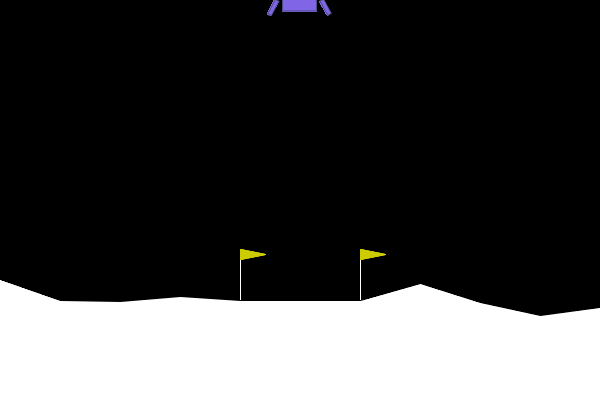

# 强化学习游戏智能体训练项目介绍

## 一、项目背景

本项目基于 OpenAI Gym/Gymnasium 强化学习环境，选择 `LunarLander-v3` 作为基础任务环境，训练智能体控制小型飞船完成安全着陆。基础任务要求智能体根据飞船的位置、速度、角度、角速度以及支架接触状态，选择合适的发动机动作，使飞船尽可能平稳地降落在指定平台上。

在完成课程基本要求的基础上，我们计划进一步拓展任务场景，使项目从单一着陆任务扩展为更复杂的轨迹规划、避障控制和多飞船调度问题，从而更充分地体现不同强化学习算法在复杂决策任务中的性能差异。

## 二、基础任务设计

### 1. 环境选择

基础环境选择：

```text
LunarLander-v3
```

该环境具有以下特点：

- 状态空间为连续状态，包含飞船位置、速度、角度、角速度和支架接触信息。
- 动作空间为离散动作，包括不喷火、左侧发动机、主发动机、右侧发动机。
- 奖励函数综合考虑飞船是否接近着陆平台、速度是否稳定、姿态是否竖直、是否成功着陆以及燃料消耗。
- 任务目标明确，且具有一定物理控制难度，适合比较不同强化学习方法。

### 2. 计划实现的算法

本项目计划实现并比较以下强化学习算法：

| 算法 | 类型 | 作用 |
|---|---|---|
| Q-Learning | 表格值函数方法 | 将连续状态离散化，作为传统强化学习基线 |
| DQN | 深度值函数方法 | 使用神经网络近似 Q 函数，适合离散动作控制 |
| Actor-Critic | 策略和值函数联合方法 | 同时学习动作策略和状态价值 |
| PPO | 策略优化方法 | 使用 clipped objective 提高策略更新稳定性 |

其中，Q-Learning 主要作为基线方法；DQN、Actor-Critic 和 PPO 用于体现深度强化学习在连续状态控制任务中的优势。

### 3. 基础评价指标

项目将从以下指标评价智能体训练效果：

| 指标 | 说明 |
|---|---|
| 平均奖励值 | 统计训练阶段和测试阶段的平均 episode reward |
| 最终表现 | 训练完成后在固定测试回合中的平均奖励和成功着陆情况 |
| 收敛速度 | 比较不同算法达到较高平均奖励所需的 episode 数 |
| 稳定性 | 比较后期 reward 波动、多次测试结果方差和不同随机种子下表现 |
| 可视化效果 | 保存训练后智能体的着陆过程 GIF，用于报告和展示 |

## 三、拓展任务计划

为了使任务场景更复杂，并体现算法在高维决策和长期规划中的差异，我们计划在基础 `LunarLander-v3` 环境上进行三类拓展。

### 拓展 1：指定轨道绕行后再降落

基础环境只要求飞船尽快稳定降落，任务目标较单一。拓展 1 计划加入“指定轨道绕行”约束，使飞船需要先经过若干指定轨迹点或绕行区域，然后再执行最终着陆。

计划设计：

- 在环境中设置若干轨迹检查点。
- 飞船需要按顺序接近检查点，完成绕行后才进入降落阶段。
- 奖励函数中加入轨迹跟踪奖励。
- 对未完成绕行就直接降落的策略进行惩罚。

预期效果：

- 提高任务的长期规划难度。
- 检验算法是否能够学习阶段性目标。
- 对比 DQN、PPO、Actor-Critic 在稀疏奖励或延迟奖励下的表现差异。

### 拓展 2：加入障碍物坐标并实现自动避障

拓展 2 计划在输入状态中加入障碍物坐标，使飞船在降落过程中需要主动避开障碍物，最终仍然安全着陆。

计划设计：

- 在环境中随机或固定生成若干障碍物。
- 扩展状态空间，加入障碍物相对飞船的位置。
- 如果飞船距离障碍物过近或发生碰撞，则给予较大惩罚。
- 在奖励函数中加入安全距离奖励或碰撞惩罚。

预期效果：

- 增加状态空间维度。
- 使任务从单纯控制问题变为“控制 + 避障”问题。
- 更明显地区分不同算法在复杂状态输入下的学习能力。

代码路径：`obstacle_lander/`

### 拓展 3：多个飞船顺序降落

拓展 3 计划将单飞船任务扩展为多个飞船顺序降落任务。多个飞船需要依次完成降落，前一个飞船的状态可能影响后续飞船的着陆空间或任务约束。

计划设计：

- 设置多个飞船的初始状态。
- 每次控制一个飞船完成降落，完成后切换到下一个飞船。
- 将已降落飞船的位置作为后续飞船的环境约束。
- 对飞船之间距离过近、碰撞或降落顺序错误进行惩罚。

预期效果：

- 增强任务的多阶段决策特征。
- 引入简单的调度思想。
- 为后续扩展到多智能体强化学习提供基础。

## 四、结果展示计划

### 1. 训练曲线

报告中计划展示以下图表：

- 各算法训练 reward 曲线。
- 各算法 rolling average reward 曲线。
- 各算法最终测试平均 reward 柱状图。
- 不同算法稳定性对比图。

### 2. GIF 可视化

已经训练好的 DQN 基础效果可以保存为 GIF，并插入实验报告和展示 PPT 中。

建议保存路径：

```text
proj/outputs/dqn_lunar_lander.gif
```

报告中可插入：

```markdown

```

如果后续 PPO 或 Actor-Critic 的效果更稳定，也可以额外保存对应 GIF，用于和 DQN 进行可视化对比。

## 五、预期成果

项目最终计划完成以下内容：

- 完成 `LunarLander-v3` 基础环境下的智能体训练。
- 实现 Q-Learning、DQN、Actor-Critic、PPO 至少四种算法 demo。
- 对不同算法进行平均奖励、收敛速度和稳定性比较。
- 保存 DQN 基础效果 GIF，用于报告展示。
- 完成至少一个拓展任务原型，优先考虑“障碍物避障”或“指定轨道绕行”。
- 在报告中分析基础任务与拓展任务的难度差异，以及不同算法表现差异。

## 六、三人分工与时间安排

> 说明：成员姓名可根据实际小组成员替换。三名成员共同完成基础任务，每人重点负责一个拓展任务。

### 1. 总体分工

| 成员 | 主要负责内容 | 具体任务 |
|---|---|---|
| 成员 A | 拓展 1：指定轨道绕行后再降落 | 设计轨迹检查点、轨道奖励函数、绕行完成判定，并保存演示效果 |
| 成员 B | 拓展 2：输入障碍物坐标并自动避障 | 设计障碍物状态输入、碰撞检测、安全距离奖励和避障演示 |
| 成员 C | 拓展 3：多个飞船顺序降落 | 设计多飞船任务流程、顺序降落机制、飞船间约束和展示结果 |

基础算法部分由三人共同完成：

| 任务 | 负责人 |
|---|---|
| Q-Learning 与 DQN 基础训练 | 成员 A、成员 B |
| Actor-Critic 与 PPO 基础训练 | 成员 B、成员 C |
| 训练曲线、测试指标、GIF 保存 | 成员 A、成员 C |
| 实验报告和 PPT 整合 | 全体成员 |

### 2. 时间安排

| 时间 | 阶段目标 | 成员 A | 成员 B | 成员 C |
|---|---|---|---|---|
| 6.14 - 6.16 | 基础任务准备 | 整理 `LunarLander-v3` 环境与运行入口 | 配置训练依赖，检查 DQN 训练流程 | 整理评价指标和结果保存格式 |
| 6.16 - 6.18 | 基础算法训练 | 训练 Q-Learning / DQN 初版 | 协助 DQN 调参，训练 Actor-Critic 初版 | 训练 PPO 初版，整理初步曲线 |
| 6.18 - 6.20 | 拓展任务实现 | 实现轨道绕行拓展原型 | 实现障碍物避障拓展原型 | 实现多飞船顺序降落拓展原型 |
| 6.20 - 6.21 | 展示材料准备 | 保存轨道绕行演示，协助生成 DQN GIF | 保存避障演示，整理基础指标 | 保存多飞船演示，整理对比表格 |
| 6.21 | 代码和效果展示 | 展示拓展 1 与 DQN 效果 | 展示拓展 2 与避障效果 | 展示拓展 3 与综合指标 |
| 6.22 - 6.24 | 实验分析 | 分析 Q-Learning / DQN 表现 | 分析 Actor-Critic 表现和避障拓展 | 分析 PPO 表现和多飞船拓展 |
| 6.24 - 6.26 | 报告撰写 | 撰写基础任务、DQN 和拓展 1 部分 | 撰写算法对比和拓展 2 部分 | 撰写 PPO、拓展 3 和结果分析部分 |
| 6.25 - 6.27 | PPT 准备 | 准备基础任务和拓展 1 展示页 | 准备算法对比和拓展 2 展示页 | 准备拓展 3、总结和答辩页 |
| 6.27 | PPT 和实验报告准备完成 | 检查代码可运行性 | 检查图表和 GIF 是否完整 | 检查报告格式和展示逻辑 |

## 七、项目亮点

本项目不仅完成课程要求的 Gym 环境强化学习训练，还尝试将基础着陆任务扩展为更复杂的控制场景。通过轨道绕行、障碍物避让和多飞船顺序降落三个方向，可以使任务从单一目标控制升级为包含长期规划、安全约束和多阶段决策的综合强化学习问题。

预期项目亮点包括：

- 多算法对比，体现传统强化学习与深度强化学习差异。
- 使用统一评价指标比较平均奖励、收敛速度和稳定性。
- 使用 GIF 展示智能体训练后的可视化效果。
- 设计拓展环境，增强项目创新性和展示效果。
- 将基础实验和拓展实验结合，形成完整的课程项目报告。
