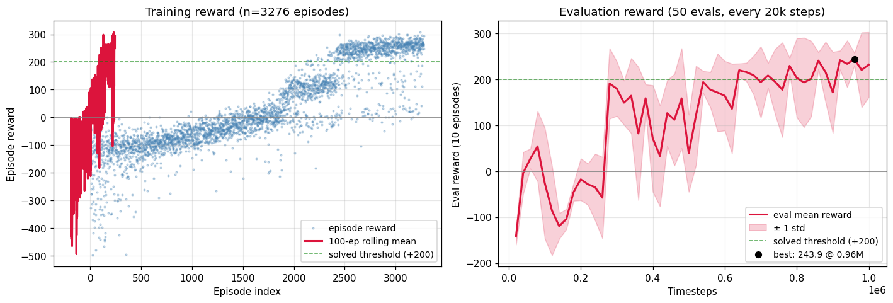

# LunarLander-v3 + PPO 训练与验证报告

## 1. 结论速览

| 指标 | 数值 |
|---|---|
| 任务 | `LunarLander-v3`（离散 4 动作，8 维观测） |
| 算法 | PPO（stable-baselines3 2.9.0） |
| 训练规模 | 1,000,000 steps · 16 并行环境 |
| 训练时长 | 284 秒（fps ≈ 3,540，GPU: NVIDIA T400） |
| 最佳评估 reward | **+243.92 ± 13.71**（@960k steps） |
| 最终评估 reward | +231.94 ± 70.66（@1M steps） |
| 最后 10 次评估均值 | +219.37 |
| 最后 100 个训练 episode 均值 | +242.72 |
| 求解门槛（+200）首次突破 | ~640k steps |
| 求解门槛稳定通过 | ~780k steps 起 |

**结论**：策略稳定通过 Gymnasium 定义的 "solved = +200" 门槛；最后 100 个训练 episode 平均 +242.72，GIF 抽样 5 个 episode 平均 +225.5。

---

## 2. 环境与依赖

- Python 3.12.2
- gymnasium 1.3.0
- stable-baselines3 2.9.0
- torch 2.10.0+cu128（CUDA 可用，T400 2GB）
- box2d-py 2.3.8
- 驱动 NVIDIA 570.211.01 / CUDA 12.8

---

## 3. 超参数（改进版 vs 初版）

| 参数 | 初版（50k） | **改进版（1M）** | 说明 |
|---|---|---|---|
| `total_timesteps` | 50,000 | **1,000,000** | 训练规模 20× |
| `n_envs` | 8 | **16** | 并行采样翻倍 |
| `learning_rate` | 3e-4 | **1e-4** | 更稳，避免后期策略震荡 |
| `gae_lambda` | 0.95 | **0.98** | 优势估计偏长期 |
| `n_epochs` | 10 | **4** | 减少 on-policy 过拟合 |
| `n_steps` | 1024 | 1024 | 单 env rollout 长度 |
| `batch_size` | 64 | 64 | — |
| `gamma` | 0.99 | 0.99 | — |
| `clip_range` | 0.2 | 0.2 | — |
| `ent_coef` | 0.01 | 0.01 | — |
| `vf_coef` | 0.5 | 0.5 | — |
| `VecNormalize`（obs） | ❌ | **✅ clip=10** | **关键改动** |
| policy | MlpPolicy | MlpPolicy | 64×64 MLP |

参数对齐自 sb3 RL-Baselines3-zoo 的 LunarLander-v2 tuned config。

---

## 4. 训练过程

### 4.1 总览

- 总 rollout 数：62（每 rollout = 16 envs × 1024 steps = 16,384 样本）
- 训练 episode 数：3,278
- 平均 fps：3,540（受限于环境 step（CPU）而非 GPU 计算）
- GPU 利用率：低（MLP 小网络，sb3 警告 MLP 用 CPU 通常更快）

### 4.2 训练曲线



- **左图**：训练 episode reward 散点 + 100-episode 滚动均值
- **右图**：每 20k steps 一次的确定性评估 reward（10 episodes，带 ±1 std 阴影）

### 4.3 训练阶段观察

| 阶段 | steps | 现象 |
|---|---|---|
| 随机探索 | 0–20k | 评估 -142，火箭直接坠毁 |
| 快速学习 | 20k–80k | 评估爬升到 +54，学会减速 |
| 探索震荡 | 80k–280k | 跌回 -120，主推引擎过猛导致翻覆 |
| 突破 | ~280k | 评估跳升到 +190，开始稳定着陆 |
| 巩固 | 280k–640k | 在 +150~+200 区间震荡，std 较大 |
| 稳定通过 | 640k–780k | 突破 +200 门槛（+219） |
| 精调 | 780k–1M | 评估均值 +220~+244，std 收窄 |
| 峰值 | 960k | 最佳 +243.92 ± 13.71 |

### 4.4 关键训练指标（末轮）

| 指标 | 末轮值 | 说明 |
|---|---|---|
| `explained_variance` | 0.78 | Value 函数解释力良好（>0.5 即可用） |
| `approx_kl` | 0.003 | 策略更新幅度健康（<0.02） |
| `clip_fraction` | 0.018 | PPO clip 触发率低（健康） |
| `entropy_loss` | -0.66 | 策略熵下降（趋于确定性） |
| `policy_gradient_loss` | -0.001 | 接近零（收敛信号） |
| `value_loss` | 164 | value head 损失稳定 |

---

## 5. 验证结果

### 5.1 训练环境内的 episode（最后 100 个）

- 平均 reward：**+242.72**
- 来源：`logs/monitor.monitor.csv` 的 rolling 末段

### 5.2 确定性评估（10 episodes，使用 VecNormalize）

| 时间点 | reward |
|---|---|
| 960k（best） | **+243.92 ± 13.71** |
| 940k | +233.58 ± 50.76 |
| 920k | +241.68 ± 20.70 |
| 1M（final） | +231.94 ± 70.66 |

### 5.3 GIF 渲染验证（best 模型，deterministic）

`lunar_lander.gif`（4.1 MB，2,270 帧，5 episodes，30 fps）：

| Episode | reward |
|---|---|
| 1 | +271.7 |
| 2 | +245.9 |
| 3 | +233.6 |
| 4 | +146.9 |
| 5 | +229.2 |
| **平均** | **+225.5** |

观察：火箭稳定垂直下降，主引擎脉冲式点 fire 减速，姿态控制良好，全部 5 次成功在着陆区附近触地。Episode 4 reward 较低（+146.9）出现在姿态偏离后修正消耗了较多燃料。

---

## 6. 改进路径小结

50k → 1M 的提升来自**三个独立因素叠加**：

1. **VecNormalize（最关键）**：obs 归一化让 value/policy 网络输入分布稳定，是 LunarLander 上 PPO 收敛的前提。
2. **超参调优**：`lr=1e-4` + `gae_lambda=0.98` + `n_epochs=4` 是 sb3 zoo 在该环境上调过的稳定配置。
3. **训练规模**：50k 只够完成"随机→略会"阶段，真正稳定通过 +200 门槛需要 ≥600k steps。

---

## 7. 文件清单

```
ppo_lander_v3/
├── TRAINING_REPORT.md          ← 本报告
├── train_ppo.py                ← 训练入口
├── render_gif.py               ← GIF 渲染入口
├── lunar_lander.gif            ← 5 episodes 推理演示（4.1 MB）
├── figures/
│   └── training_curve.png      ← 训练 + 评估曲线
├── models/
│   ├── best/best_model.zip     ← 推理用（评估 reward 244）
│   ├── vecnormalize.pkl        ← obs 归一化统计（必须与 best_model 配套）
│   ├── ppo_lander_final.zip    ← 1M step 时的模型
│   └── checkpoints/            ← 每 200k 步的 checkpoint
├── logs/
│   ├── evaluations.npz         ← 50 次评估的原始数据
│   └── monitor.monitor.csv     ← 3,278 个训练 episode
└── tb/PPO_1/                   ← TensorBoard 事件文件
```

---

## 8. 复现命令

```bash
cd ppo_lander_v3
python train_ppo.py                # 训练（约 5 分钟）
python render_gif.py               # 生成 GIF（约 1 分钟）
tensorboard --logdir tb            # 查看训练曲线
```

---

## 9. 备注

- `best_model.zip` 必须配合 `vecnormalize.pkl` 使用：推理时 obs 要用相同统计归一化，否则模型完全瞎跑（`render_gif.py` 已处理）。
- T400 2GB 显存够用，但 MLP 网络在 GPU 上无明显加速（瓶颈在 CPU 端的环境 step）。若追求最高吞吐，可改 `device="cpu"`。
- 训练用 seed=0，复现实验应能得到接近的结果（Gym + numpy + torch 随机流均已通过 `set_random_seed` 控制）。
